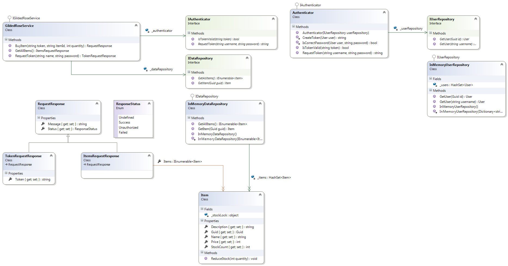

**Gilded Rose Take Home Assignment**

Hi and welcome to my assignment.  I hope this is what you were looking for :)

This project satisfies the deliverables you asked for.  

1. A system that can process the two API requests via HTTP - Refer to GildedRose.ServiceLibrary
2. Appropriate tests (unit, integration, etc) - Refer to GildedRose.ServiceLibrary.Tests
3. Explanations: 
 3. I chose DataContracts for the dataformat because it is easy to implement and it's what I'm familiar with from working with. 
 3. For authentication I chose a token based system to maintain a RESTful Api.  The users are managed and a valid username and password is required to retrieve a token.  This token can then be used to purchase items. 
  


 
**Get All Items**
----
  Returns data contract listing all items.


* **Method:**

  `GetAllItems`
 
* **URL**

  /GetAllItems
  
*  **URL Params**

   `none`

* **Data Params**

  None

* **Success Response:**
```xml
 <GetAllItemsResponse xmlns="http://kimbilida.com/GildedRoseService/v1">
      <GetAllItemsResult xmlns:i="http://www.w3.org/2001/XMLSchema-instance">
        <Message i:nil="true" />
        <Status>Success</Status>
        <Items>
          <Item>
            <Description>A ming dynasty vase</Description>
            <Guid>2d923329-9b0e-4e5b-adf0-987b2fc8f14c</Guid>
            <Name>Vase</Name>
            <Price>1000</Price>
            <StockCount>3</StockCount>
          </Item>
          <Item>
            <Description>Organic butter</Description>
            <Guid>e74d9e5e-4163-4ea5-a3cc-d7c2a439bf4d</Guid>
            <Name>Butter</Name>
            <Price>10</Price>
            <StockCount>20</StockCount>
          </Item>
          <Item>
            <Description>Plain old dirt</Description>
            <Guid>a5fccbf0-75f7-407f-b332-216154f1635f</Guid>
            <Name>Dirt</Name>
            <Price>1</Price>
            <StockCount>10000000</StockCount>
          </Item>
          <Item>
            <Description>Sulfuras, Hand of Ragnaros</Description>
            <Guid>0baf8eb5-661b-4148-a571-c78ca944f239</Guid>
            <Name>Sulfuras, Hand of Ragnaros</Name>
            <Price>1000000</Price>
            <StockCount>0</StockCount>
          </Item>
        </Items>
      </GetAllItemsResult>
    </GetAllItemsResponse>
```
 
* **Error Response:**
```xml
    <GetAllItemsResponse xmlns="http://kimbilida.com/GildedRoseService/v1">
      <GetAllItemsResult xmlns:i="http://www.w3.org/2001/XMLSchema-instance">
        <Message>An error occurred retrieving items</Message>
        <Status>Failure</Status>
      </GetAllItemsResult>
    </GetAllItemsResponse>
```


**Request Authentication Token**
----
  Returns a token to be used for further authentication requests.


* **Method:**

  `RequestToken`
 
* **URL**

  /RequestToken?name=name&password=password
  
*  **URL Params**

   **Required:**
 
   `name=[string]`
   
   `password=[string]`

* **Data Params**

  None

* **Success Response:**
```xml
<TokenRequestResponse xmlns="http://kimbilida.com/GildedRoseService/v1" xmlns:i="http://www.w3.org/2001/XMLSchema-instance">
 <Message i:nil="true"/>
 <Status>Success</Status>
 <Token>f1c819f7-9f06-4341-a659-91f0e3effaa2</Token>
</TokenRequestResponse>
```
 
* **Error Response:**
```xml
<TokenRequestResponse xmlns="http://kimbilida.com/GildedRoseService/v1" xmlns:i="http://www.w3.org/2001/XMLSchema-instance">
 <Message>Authentication failed for xxx.</Message>
 <Status>Failed</Status>
 <Token i:nil="true"/>
</TokenRequestResponse>
```
##TO DO
For the sample assignment I stopped just after meeting the requirements.  The next most importants step for me would be (in no particular order):
- Add logging
- Convert the HashProvider to an interface and remove the static methods
- Provide real security and token authentication
- Improve performance when using the channel factory to make requests

##More information
As a caveat:  I am totally unfamiliar with public facing services.  My current work involves inter-service communication so we use a licening system for authentication or in some instances private-public keys.
Since this is just sample code I went with InMemory data stores for simplicity.  I also know very little about User Authentication and Token creation so the Token is simply the user Guid. 
I definitely need to learn more about creating secure tokens but I felt it was beyond the scope of this assignment.  I made a brief attempt to securly store passwords and after a bit of searching I 
gained a better appreciation of how complex this is.  I might have been better off trying to use OAuth or OpenID, but again I felt that was beyond the scope of this assignment.
I hope this gives you enough information to get an idea of my coding style. 


##Getting Started

Clone the repository. Build the solution. 
- Run unit tests. OR
- Set the ServiceLibrary as the startup project and run it.  Visual Studio will provide an interface for testing. OR
- Run the ServiceHost as administrator and browse to urls described above


##License

MIT

##Suggested attribution

This work is by Kim Bilida
